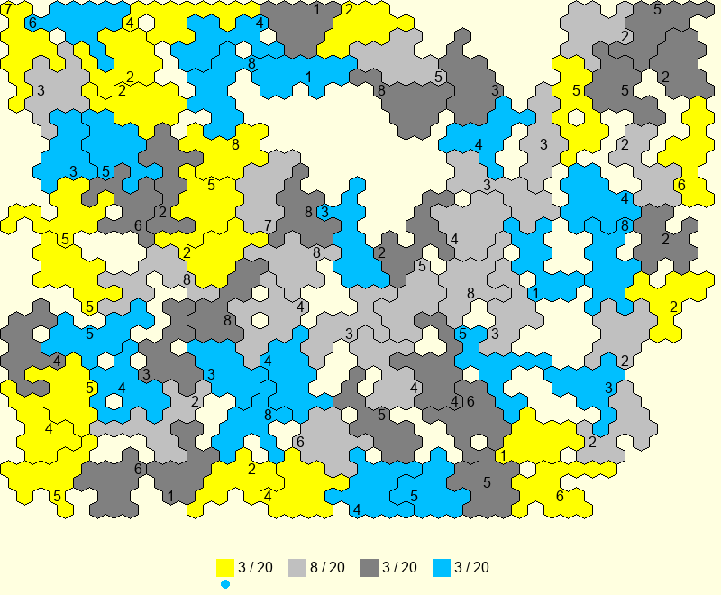

# 🎲 Dice Wars

四个国家，一张随机生成的六边形大陆，每块领土上堆着不等数量的骰子。你的目标很简单——吞掉所有人。



## 怎么玩

**进攻：** 点自己的地 → 点旁边敌人的地。双方同时掷骰（骰子数 = 地块上的数字），点数和大的赢。

- 赢了：敌方领土归你，骰子推过去（少一颗留守）
- 输了：你的进攻方地块只剩 1 颗骰子，下次进攻前三思

**结束回合：** 点底部状态栏。系统会数你最大的一片连通领土有多大，然后随机往你的地上撒那么多颗骰子。所以——保持领土连在一起比四处飞地强得多。

**观察：** 加骰子时地块会闪烁，告诉你哪里变强了。盯紧对手加了哪里，下回合优先打断他的连通。

## 胜负的关键

> 8 颗骰子 vs 1 颗看似碾压，但掷骰子就是掷骰子——3 颗偶尔也能爆掉 5 颗。

- 概率站在骰子多的一边，但翻盘随时可能发生
- 集中优势兵力，从弱处撕开
- 保持连通 = 每回合补给更多
- 有时候不打比乱打强——省下骰子等对手先互咬

## 运行

```bash
pip install pygame
python3 main.py
```

启动后你会看到地图一块块长出来，像长苔藓一样。等它铺满就可以开始了。

## 小提示

- 地块上数字越大越猛，8 是上限
- 1 颗骰子的地不能主动进攻（掷出 0）
- 四个国家轮流来，底部圆点标记当前谁在动
